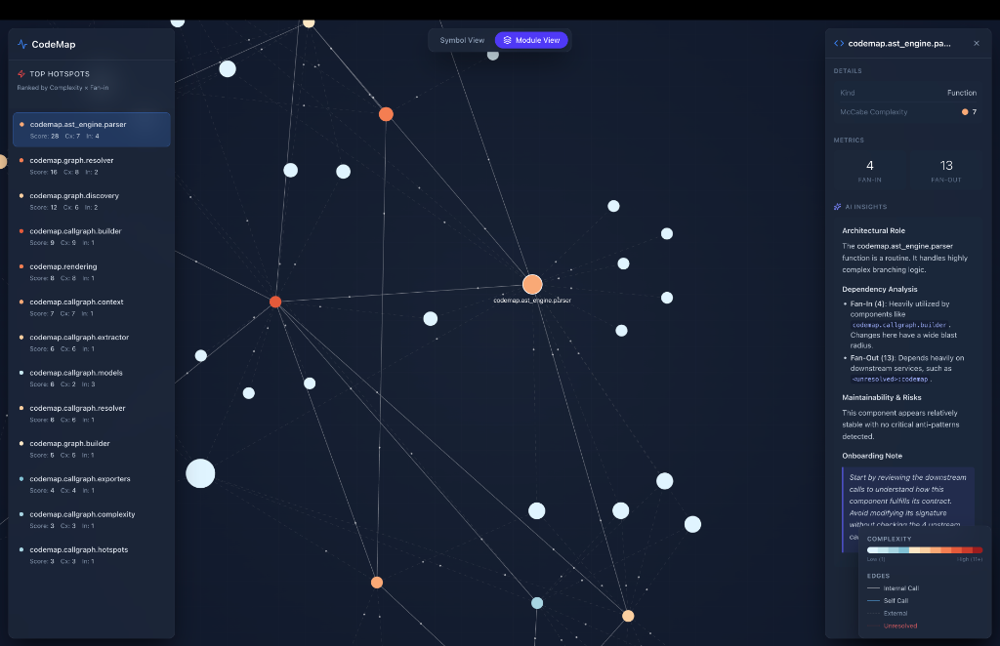

<div align="center">
  <h1>CodeMap</h1>
  <p>Cinematic architecture visualization for modern Python codebases.</p>
  <br />
  
  <br />
</div>

<br />

CodeMap provides deep structural visibility into complex Python repositories. It combines a robust AST parsing backend with a high-performance, WebGL-accelerated frontend to expose architectural patterns, dependency cycles, and systemic hotspots in real time.

<br />

## Capabilities

- **Intelligent Extraction:** Statically analyzes Python source code to extract precise symbol-level and module-level dependency graphs, including Fan-In, Fan-Out, and McCabe Complexity metrics.
- **Cinematic Presentation:** Renders dense architectures utilizing `react-force-graph-2d` with custom collision physics, ambient particle flows, and progressive label disclosure to maintain readability at scale.
- **Architectural Diagnostics:** Implements Tarjan's Strongly Connected Components (SCC) algorithm directly on the client to isolate and highlight circular dependencies in real time.
- **AI Insights:** Integrates an extensible AI abstraction layer to automatically generate architectural context, risk assessments, and onboarding documentation for selected modules.

<br />

## Architecture

CodeMap is decoupled by design to ensure the parsing logic does not pollute the visualization environment.

1.  **Backend (`src/codemap`):** A strict, zero-dependency Python CLI utilizing the standard `ast` module to build network graphs and export static JSON.
2.  **Frontend (`web/`):** A Vite, React, and Tailwind v4 application optimized for high-framerate rendering and cinematic glassmorphism UI.

<br />

## Quickstart

**1. Generate the architecture graph**
```bash
codemap callgraph src/ --format json --output web/public/data.json
```

**2. Launch the visualization dashboard**
```bash
cd web
npm install
npm run dev
```

<br />

## Roadmap

- [x] Phase 1: Core AST extraction and JSON schema definition
- [x] Phase 2: Force-directed canvas and glassmorphism interface
- [x] Phase 3: Client-side module aggregation and SCC cycle detection
- [x] Phase 4: AI Insights engine abstraction
- [ ] Phase 5: Live FastAPI server (`codemap serve`) for dynamic codebase resynchronization
- [ ] Phase 6: Direct LLM API integration for automated refactoring proposals

<br />

---
<div align="center">
  <p>Built for scale. Designed for clarity.</p>
</div>
