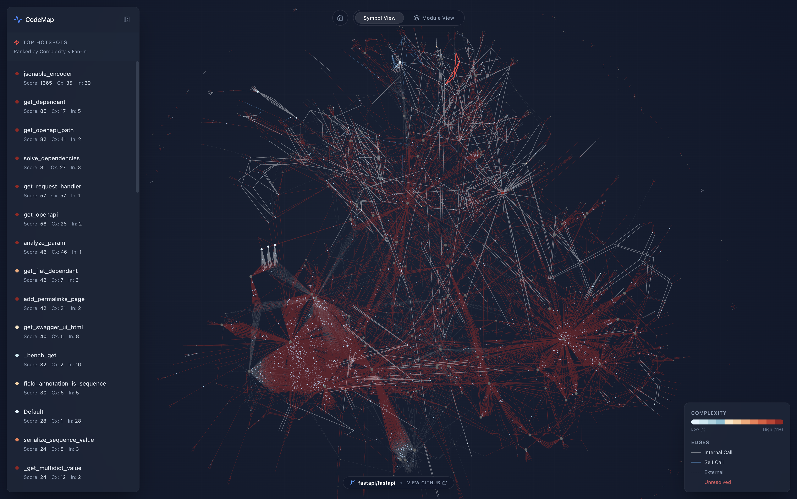
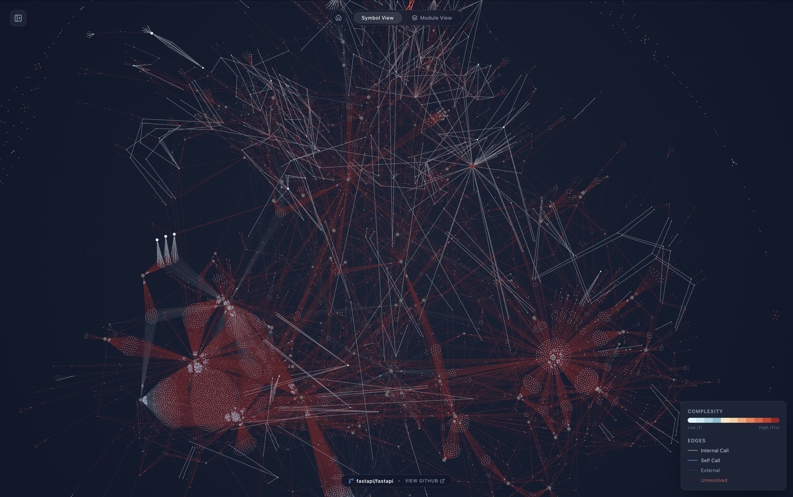
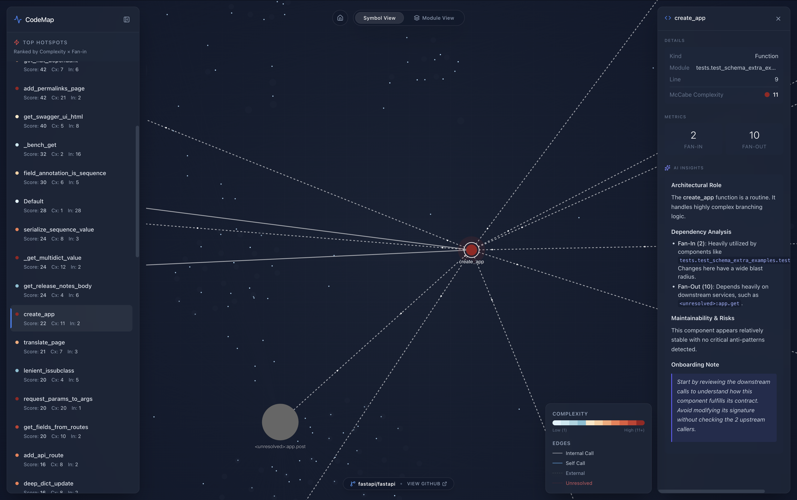
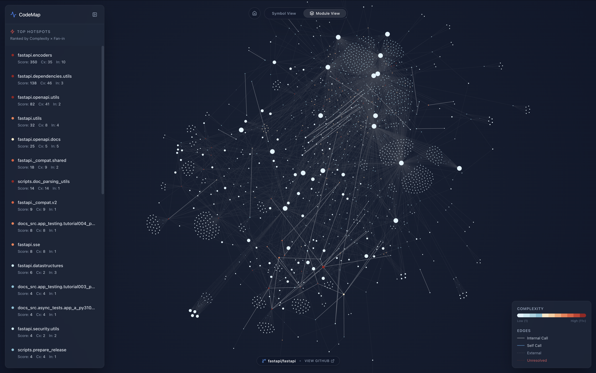
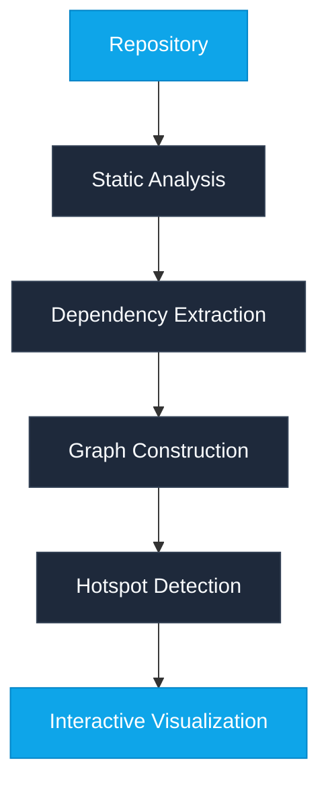

<div align="center">

# CodeMap

**Visualize, explore, and understand software architecture through interactive dependency graphs.**

<br/>

[](https://codemap-teal.vercel.app/?)
&nbsp;&nbsp;
[](https://github.com/Purrnanssh/codemap)

<br/>



</div>

---

## The Problem

Navigating a large, unfamiliar codebase is inherently difficult. Developers are typically constrained to reading flat files, traversing deeply nested directories, and relying on global searches to build a mental model of an architecture.

Without spatial context, identifying technical debt, tracing execution flow, and safely planning major refactors becomes an exercise in guesswork. Software is fundamentally a network of relationships, yet modern developer tooling rarely treats it as one.

---

## Why CodeMap

CodeMap solves architectural blindness by automatically transforming static code into living, physics-based network topologies.

| Capability | Description |
| :--- | :--- |
| **Dependency Graphs** | Visualize relationships across an entire repository |
| **Hotspot Detection** | Surface high-risk architectural components |
| **Fan-In/Fan-Out Analysis** | Understand coupling and dependency flow |
| **AI Insights** | Architectural observations and onboarding guidance |
| **Symbol & Module Views** | Explore systems at multiple abstraction levels |

---

## Screenshots

<div align="center">

### Architecture Graph

*Interactive symbol-level dependency topology.*

<br/>

### Hotspot Explorer

*Isolate and inspect highly complex, critical nodes.*

<br/>

### Dependency Inspector

*Granular fan-in and fan-out relationship flow.*

</div>

---

## Architecture Pipeline


```mermaid
graph TD
    A[Repository] --> B[Static Analysis]
    B --> C[Dependency Extraction]
    C --> D[Graph Construction]
    D --> E[Hotspot Detection]
    E --> F[Interactive Visualization]

    classDef default fill:#1e293b,stroke:#334155,color:#f8fafc;
    classDef highlight fill:#0ea5e9,stroke:#0284c7,color:#ffffff;
    class A highlight
    class F highlight
```

---

## Tech Stack

| Layer | Technologies |
| :--- | :--- |
| **Frontend** | React, TypeScript, Tailwind, Framer Motion |
| **Visualization** | D3.js, Force Graph |
| **Backend** | Python, FastAPI |
| **Analysis** | AST Parsing, Static Analysis |
| **Deployment** | Vercel, Railway |

---

## Use Cases

- Onboarding onto unfamiliar codebases
- Open-source contribution discovery
- Dependency auditing
- Refactor planning
- Architectural reviews
- Technical debt discovery

---

## Roadmap

- **TypeScript/JavaScript Support:** Extend parser for modern JS ecosystems.
- **Global Search:** Instantly locate specific symbols within the graph.
- **Graph Export:** Export topologies to high-resolution SVGs or JSON data.
- **Direct IDE Integrations:** Embed visualizations natively within VS Code.
- **Team Workspaces:** Shared architectural views and persistent states.

---

## Getting Started

### Local Setup

**Backend**
```bash
cd backend
python -m venv venv
source venv/bin/activate
pip install -r requirements.txt
uvicorn main:app --reload --port 8000
```

**Frontend**
```bash
cd web
npm install
npm run dev
```

Create a `.env` in the `web` directory:
```env
VITE_API_URL=http://localhost:8000
```

---

<p align="center">
  <strong>Built by Purrnanssh Sinha</strong>
  &nbsp;
  <a href="https://www.linkedin.com/in/purrnanssh/" target="_blank">
    
  </a>
</p>
